# Furkids

## Overview

A minimalist web application for pet grooming appointment bookings. This MVP enables pet owners to schedule grooming appointments and helps groomers manage their schedule.

##

In today's fast-paced world, everyone is busy doing something. Caring for a pet means having to send them for regular grooming appointments. However, most groomers require you to contact them via WhatsApp in order to book appointments. This creates unnecessary friction in what should be a straightforward process.
Pet owners must interrupt their day to send messages, wait for responses, and negotiate available time slots through back-and-forth conversations. This outdated booking method wastes valuable time for both pet owners and groomers alike.
Wouldn't it be great to be able to simply login and book an available time slot to send your pet for grooming? A digital solution that displays real-time availability, eliminating communication lag time and reduce scheduling errors would give owners the convenience of managing their appointments around their own schedule.
This would also be a benefit to groomers looking to digitize and streamline their daily operations, by providing an overview of their daily, weekly and monthly appointments at a glance. Gain valuable business insights by identifying peak hours and available slots, reducing double booking and scheduling errors that lead to unsatisfied customers and lost sales. With a digital appointment scheduling system, your resource planning capabilities become more effective: allocate staff better, plan assistant coverage, maximize use of grooming stations, bathing areas and drying equipment.

## Features

- **Dual User System**: Separate interfaces for pet owners and groomers
- **Pet Profiles**: Create and manage basic pet information
- **Fixed Service Options**: Two service types with preset durations
- **Appointment Scheduling**: Book appointments based on groomer availability
- **Appointment Management**: Cancel or update appointments with time restrictions
- **Groomer Controls**: Groomers can view and manage their schedule
- **Basic Notifications**: Toast notifications for booking confirmations and cancellations

## Live URL

- **[furkids.vercel.app](https://furkids.vercel.app)** - Custom domain added for easier recognition and memorability
- **[pet-app-liart.vercel.app](https://pet-app-liart.vercel.app)** - Original auto-generated Vercel domain

Both URLs point to the same application. The backend API is hosted separately on Render.

## Technology Stack

- **Frontend**: React with Material UI components
- **Backend**: Express.js with REST API
- **Database**: MongoDB (hosted on MongoDB Atlas)
- **Authentication**: JWT-based authentication
- **Deployment**: Frontend (client) deployed on Vercel, Backend (server) deployed on Render

## Screenshots

### Authentication

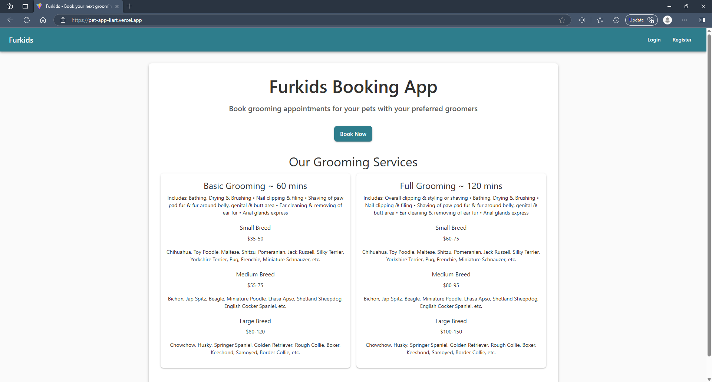
_Landing Page_

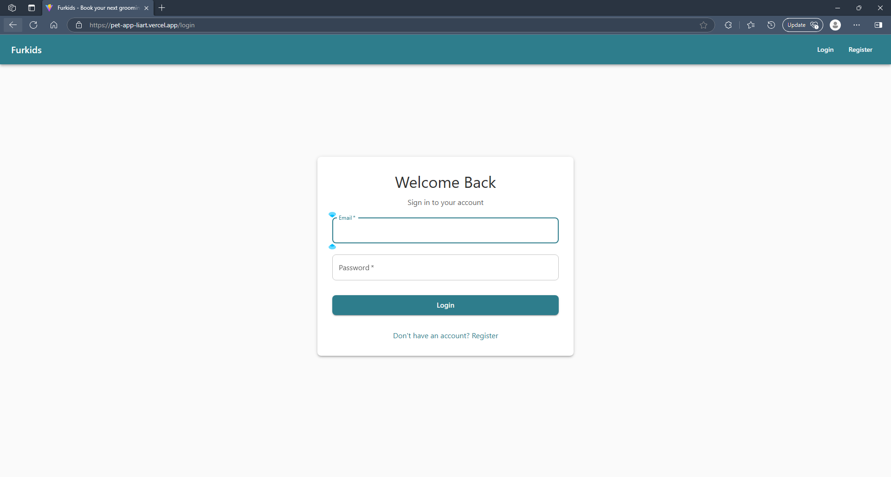
_Login page with email and password authentication_

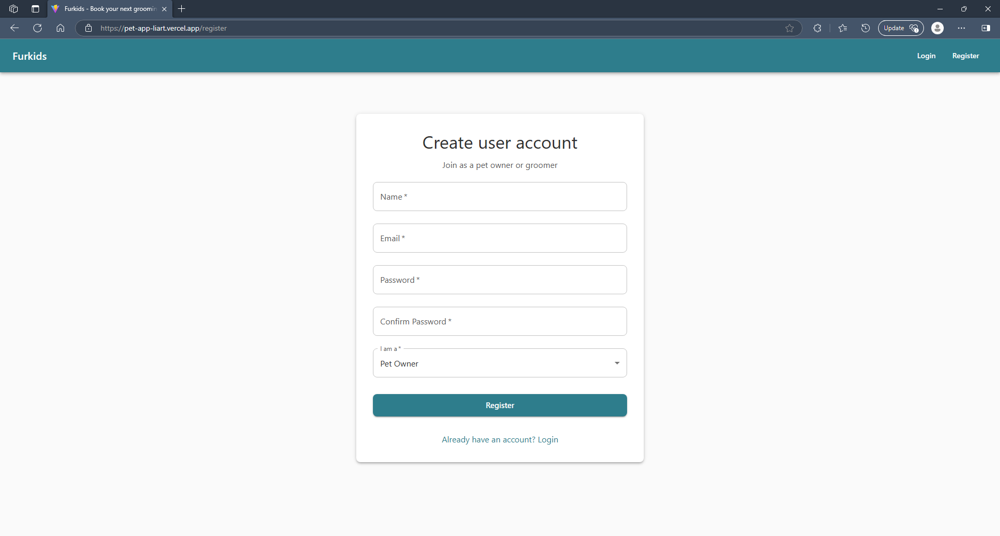
_Registration page for new users with role selection_

### Pet Owner Dashboard

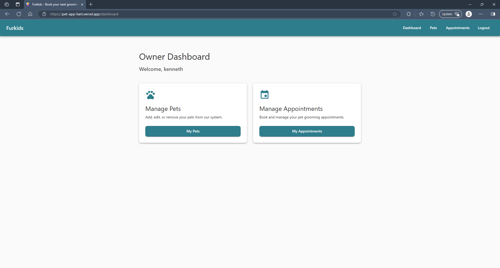
_Owner dashboard to manage appointments and registered pets_

### Pet Management

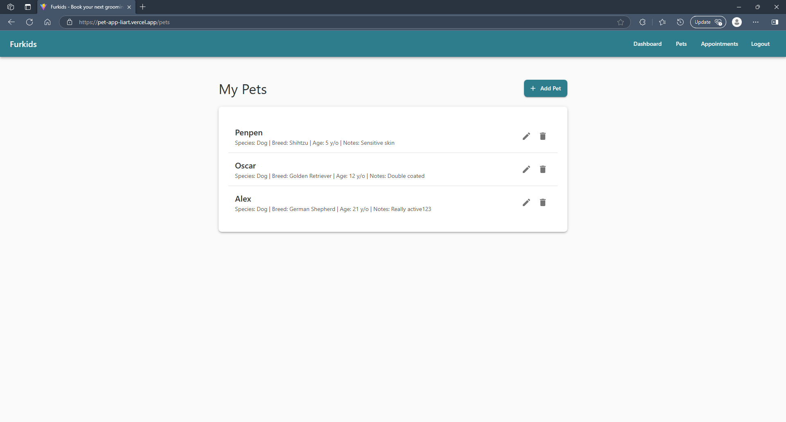
_Pet management interface for adding and updating pet information_

### Appointment Management and Booking

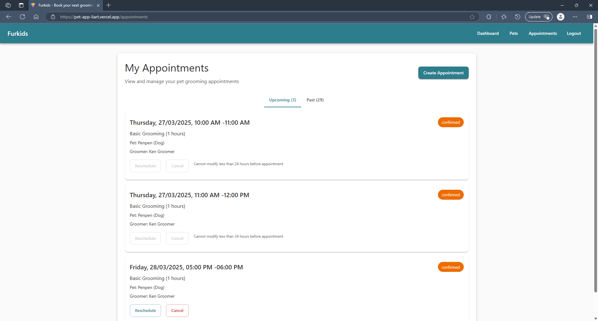
_View upcoming appointments, reschedule or cancel if more than 24 hours away_

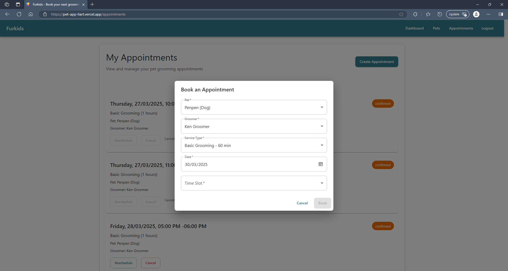
_Appointment booking interface with available time slots_

### Groomer Interface

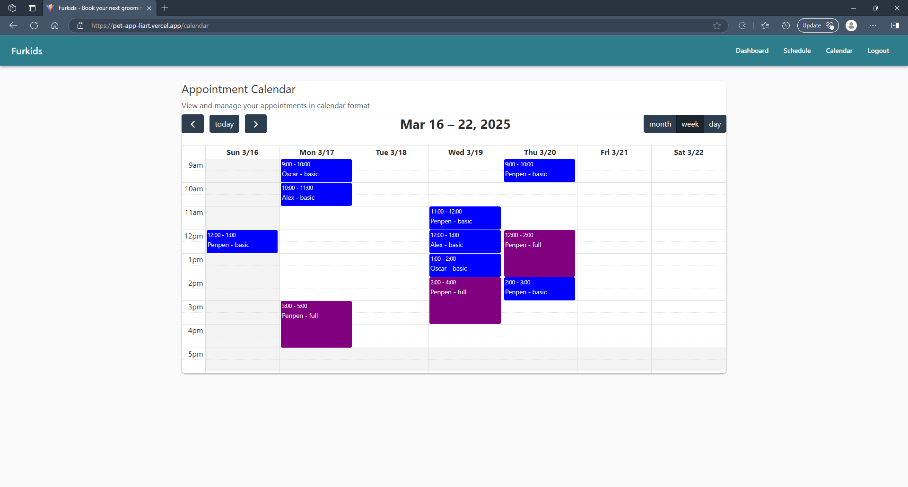
_Monthly calendar view for groomers to manage appointments_

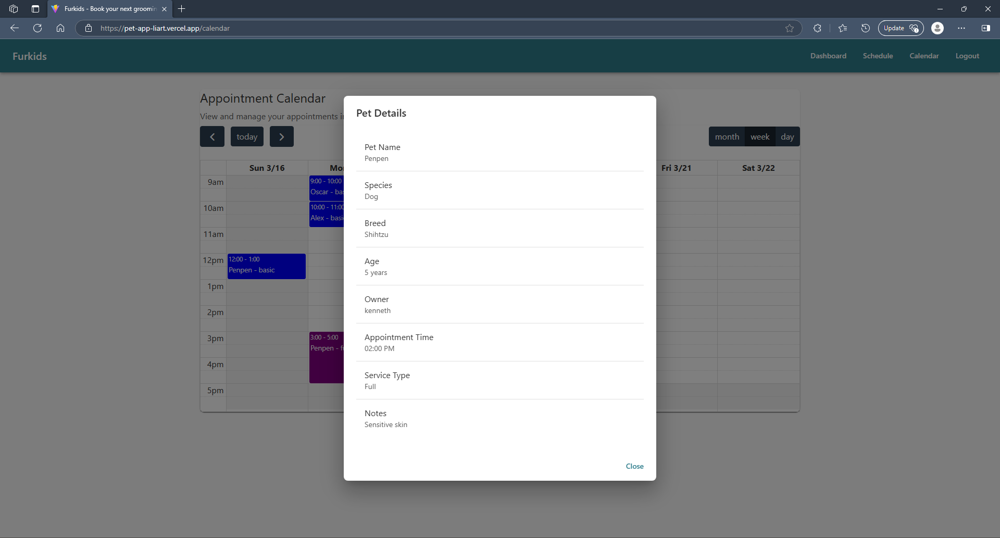
_Groomers can click individual appointments to view appointment specific pet details_

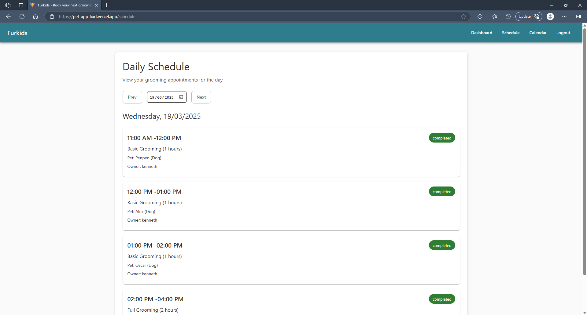
_Daily schedule view showing detailed appointment information_

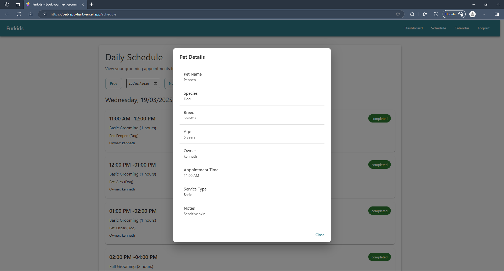
_Groomers can click specific appointments to view pet details_

## User Stories

### Authentication & User Management

#### As a new user (pet owner)

- I want to register for an account so that I can book grooming appointments
- I want to log in to my account so that I can access the booking system
- I want to log out of my account to keep my information secure

#### As a new user (groomer)

- I want to register as a groomer so that I can provide grooming services
- I want to log in to my groomer account to manage my appointments
- I want to log out of my account when I'm done for the day

### Pet Management

#### As a pet owner

- I want to add a new pet to my profile so I can book appointments for them
- I want to view all my pets in one place for easy management
- I want to see my pet's grooming history to track previous services
- I want to be able to update notes for my pet so the groomer will be better prepared

### Appointment Management

#### As a pet owner

- I want to select either Basic (60 minutes) or Full (120 minutes) grooming options
- I want to be able to add a pet so I can send it for grooming
- I want to see a list of appointments to remember when to bring my pet
- I want to see a list of past appointments to track my pet's grooming history
- I want to be create an grooming appointment for a pet by selecting a specific groomer
- I want to know what time slots are available for the groomer by selecting a date
- I want to to be able to reschedule an appointment (more than 24 hours before the start time)
- I want to to be able to cancel an appointment (more than 24 hours before the start time)
- I want to be see notifications when I create, reschedule or cancel an appointment

#### As a groomer

- I want to see my daily schedule of appointments to prepare for my day
- I want to see my past and future appointments to track my work history
- I want to view details of pets for upcoming appointments to better prepare for the session

### Availability

#### As a groomer

- I want to be able to manage my availability by setting my work hours/days (Stretch)

## Getting Started

### Prerequisites

- Node.js (v14 or higher)
- npm or yarn
- MongoDB Atlas account (for database)

### Installation

1. Clone the repository

   ```
   git clone https://github.com/kenzychew/pet-app.git
   cd pet-app
   ```

2. Install dependencies

   ```
   npm install
   ```

3. Create a .env file in the root directory with the following variables:

   ```
   MONGODB_URI=your_mongodb_connection_string
   JWT_SECRET=your_jwt_secret
   ```

4. Start the development server

   ```
   npm run dev
   ```

5. Open your browser and navigate to `http://localhost:3000`

## Project Structure

```
pet-app/
├── client/               # Frontend React application
│   ├── public/
│   └── src/
│       ├── components/   # UI components
│       ├── config/       # Centralized API config
│       ├── contexts/     # React context for state management
│       ├── hooks/        # Custom Hooks
│       ├── pages/        # Page components
│       └── services/     # API service calls
│       └── utils/        # Utility functions
├── server/               # Backend Express application
│   ├── controllers/      # Request handlers
│   ├── middleware/       # Express Middleware
│   ├── models/           # Database models
│   ├── routes/           # API routes
│   └── utils/            # Utility functions
└── README.md
```

## API Endpoints

### Authentication

- `POST /api/auth/register` - Register a new user (owner or groomer)
- `POST /api/auth/login` - User login

### Pet Management

- `GET /api/pets` - Get all pets for the current user (owner)
- `GET /api/pets/:id` - Get a specific pet by ID
- `POST /api/pets` - Create a new pet (owners only)
- `PUT /api/pets/:id` - Update a pet
- `DELETE /api/pets/:id` - Delete a pet

### Groomer Availability

- `GET /api/groomers` - List all available groomers
- `GET /api/groomers/:id` - Get details for a specific groomer
- `GET /api/groomers/:id/availability?date=YYYY-MM-DD&duration=60` - Get available appointment slots

### Appointments

- `POST /api/appointments` - Book a new appointment (owners only)
- `GET /api/appointments` - Get all appointments for the current user
- `GET /api/appointments/:id` - Get a specific appointment by ID
- `PUT /api//appointments/:id` - Reschedule appointment (owners only)
- `DELETE /api/appointments/:id` - Delete appointment (owners only)

## Database Schema

### Users

- `_id`: ObjectId
- `email`: String (unique)
- `password`: String (hashed)
- `name`: String
- `role`: String (owner/groomer)
- `createdAt`: Date

### Pets

- `_id`: ObjectId
- `name`: String
- `species`: String
- `breed`: String
- `age`: Number
- `ownerId`: ObjectId (reference to User)
- `notes`: String
- `createdAt`: Date
- `updatedAt`: Date

### Appointments

- `_id`: ObjectId
- `petId`: ObjectId (reference to Pet)
- `ownerId`: ObjectId (reference to User)
- `groomerId`: ObjectId (reference to User)
- `serviceType`: String (basic/full)
- `duration`: Number (60 or 120 minutes)
- `startTime`: Date
- `endTime`: Date
- `status`: String (confirmed/cancelled/completed)
- `createdAt`: Date
- `updatedAt` : Date

#### Appointment Methods

- **Instance Methods**:

  - `canModify()`: Checks if appointment can be modified (>24h before start)
  - `shouldBeCompleted()`: Checks if appointment should be marked as completed

- **Static Methods**:
  - `updateCompletedAppointments(appointments)`: Updates status of confirmed appointments that have ended
  - `checkForConflicts(groomerId, startTime, endTime, excludeAppointmentId)`: Checks for time conflicts with existing appointments
  - `getGroomerAvailability(groomerId, date)`: Gets all confirmed appointments for a groomer on a given day
  - `getAvailableTimeSlots(groomerId, date, duration)`: Generates available time slots based on business hours and existing appointments

```
// Time Slot Calculation
// added these static methods to simplify availability checks, controller will be a lot cleaner
// get all confirmed appointments for a groomer on a given day
AppointmentSchema.statics.getGroomerAvailability = async function (groomerId, date) {
  // convert date to start/end of day
  const startOfDay = new Date(date);
  startOfDay.setHours(0, 0, 0, 0);

  const endOfDay = new Date(date);
  endOfDay.setHours(23, 59, 59, 999);

  // find all appointments with confirmed status for this groomer on this day
  // sort by startTime
  const appointments = await this.find({
    groomerId,
    status: "confirmed",
    startTime: { $gte: startOfDay, $lte: endOfDay },
  }).sort({ startTime: 1 });

  return appointments;
};

AppointmentSchema.statics.getAvailableTimeSlots = async function (groomerId, date, duration) {
  // biz hours (should be variable but lets hardcode this for now)
  const businessStart = 9;
  const businessEnd = 17;

  // get all appointments for this day
  const appointments = await this.getGroomerAvailability(groomerId, date);

  // start with full day slots in 60-minute increments
  const dayDate = new Date(date); // 2024-03-16 => 2024-03-16T00:00:00
  const slots = [];

  // generate all possible time slots during biz hours
  for (let hour = businessStart; hour < businessEnd; hour++) {
    for (let minute = 0; minute < 60; minute += 60) {
      const slotStart = new Date(dayDate); // Date obj for start time
      slotStart.setHours(hour, minute, 0, 0); // set seconds and ms to 0

      const slotEnd = new Date(slotStart);
      slotEnd.setMinutes(slotStart.getMinutes() + duration);

      // do not add slots that extend beyond biz hrs
      if (
        slotEnd.getHours() < businessEnd || // if end time before 5pm
        (slotEnd.getHours() === businessEnd && slotEnd.getMinutes() === 0) // if end time is exactly 5:00pm
      ) {
        slots.push({
          start: new Date(slotStart),
          end: new Date(slotEnd),
          available: true,
        }); // get array of slot objs
      }
    }
  }

  // mark slots as unavailable if they conflict with existing appointments
  // loop through all existing (confirmed) appointments
  for (const appointment of appointments) {
    const appointmentStart = new Date(appointment.startTime);
    const appointmentEnd = new Date(appointment.endTime);
    // loop through all possible slots
    for (const slot of slots) {
      // check if proposed slot overlaps with existing appointment
      if (slot.start < appointmentEnd && slot.end > appointmentStart) {
        slot.available = false;
      }
    }
  }

  // filter and return only available slots
  return slots.filter((slot) => slot.available);
};
```

## Service Structure

- **Service Types as Appointment Properties**:

  - Basic Grooming: 60 minutes duration
  - Full Grooming: 120 minutes duration
  - Selected at the time of booking as a property of the appointment

- **Groomer Availability**:
  - All groomers are available from 09:00 to 17:00 daily by default
  - All groomers provide both basic and full grooming services

## Appointment Rules

- **Creation**:

  - Only pet owners can create bookings
  - Appointments must fall within groomer's available timeslots (09:00-17:00)
  - System must check for existing appointments to avoid conflicts

- **Updates**:

  - Only allowed more than 24 hours before the appointment
  - Subject to groomer's available timeslots
  - Updates by owners are reflected on the groomer's dashboard

- **Cancellation**:

  - Only allowed more than 24 hours before the appointment
  - Cancellations by owners are reflected on the groomer's dashboard

- **Status Types**:
  - Confirmed
  - Completed

## Future Enhancements (Post-MVP)

- Payment processing integration
- Advanced reporting and analytics
- Customer reviews and ratings
- Recurring appointment scheduling
- Mobile app version

## Attributions

### React

https://stackoverflow.com/questions/73120266/how-can-i-combine-multiple-state-values-into-one-usestate
https://react.dev/learn/choosing-the-state-structure
https://www.robinwieruch.de/react-hooks-fetch-data
https://blog.logrocket.com/best-react-scheduler-component-libraries
https://medium.com/@linjdiana/creating-an-appointment-calendar-using-react-js-cd9912be06f6
https://www.dhiwise.com/post/react-appointment-scheduler-top-libraries-for-event-booking
https://www.geeksforgeeks.org/appointment-management-system-using-react
https://stackoverflow.com/questions/3552461/how-do-i-format-a-date-in-javascript
https://javascript.info/date
https://www.dhiwise.com/post/guide-to-integrating-react-hook-form-with-material-ui
https://dev.to/jps27cse/understanding-layout-components-and-react-router-outlet-in-react-3l2e
https://isamatov.com/react-fullcalendar-tutorial
https://github.com/fullcalendar/fullcalendar-react/issues
https://youtu.be/X2zLbKimvQQ?si=9CzuMgBe6opBIEk0
https://fullcalendar.io/docs/event-object
https://stackoverflow.com/questions/61244957/how-to-show-value-when-using-date-type-in-textfield
https://github.com/facebook/react/issues/14920
https://stackoverflow.com/questions/55840294/how-to-fix-missing-dependency-warning-when-using-useeffect-react-hook

### Material UI

https://mui.com/material-ui/api/app-bar
https://mui.com/material-ui/api/toolbar
https://mui.com/material-ui/api/typography
https://mui.com/material-ui/api/button
https://mui.com/material-ui/api/text-field/
https://mui.com/material-ui/api/card/
https://mui.com/material-ui/api/dialog/
https://mui.com/material-ui/api/grid/
https://mui.com/material-ui/api/box
https://mui.com/material-ui/api/select/
https://mui.com/material-ui/api/tabs/
https://mui.com/material-ui/api/snackbar/
https://mui.com/material-ui/api/paper/
https://mui.com/material-ui/api/list/
https://mui.com/system/the-sx-prop
https://mui.com/material-ui/migration/pickers-migration/
https://mui.com/material-ui/customization/theming/

### Node.JS / MongoDB

https://stackoverflow.com/questions/71142537/how-to-join-model-in-mongodbmongoose-and-express
https://chankapure.medium.com/building-a-doctor-appointment-scheduler-with-node-js-and-mongodb-10b52fba79af
https://developer.mozilla.org/en-US/docs/Learn_web_development/Extensions/Server-side/Express_Nodejs/mongoose
https://dev.to/itz_giddy/how-to-query-documents-in-mongodb-that-fall-within-a-specified-date-range-using-mongoose-and-node-524a
https://www.corbado.com/blog/nodejs-express-mongodb-jwt-authentication-roles
https://stackoverflow.com/questions/61464600/how-create-a-schema-for-booking-system-with-availability-time-slots
https://stackoverflow.com/questions/48782039/mongodb-find-and-insert-if-time-slots-doesnt-conflict-with-other-time-slots

### Express MVC

https://stackoverflow.com/questions/11076179/node-js-express-routes-vs-controller
https://dev.to/ericchapman/nodejs-express-part-5-routes-and-controllers-55d3
https://developer.mozilla.org/en-US/docs/Learn_web_development/Extensions/Server-side/Express_Nodejs/routes
https://mongoosejs.com/docs/schematypes.html
https://mongoosejs.com/docs/models.html
