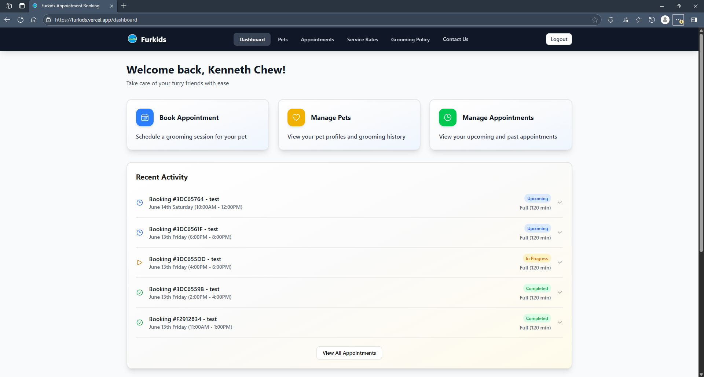

# Furkids

## Overview

Furkids is a modern web application that streamlines the pet grooming appointment booking process. It provides a seamless digital solution for both pet owners and groomers, eliminating the need for manual scheduling through messaging apps.

### Key Benefits

#### For Pet Owners

- Real-time appointment booking with instant confirmation
- View and manage appointments at your convenience
- Track pet grooming history and special instructions
- Automated reminders and notifications

#### For Groomers

- Digital schedule management with calendar view
- Automated availability tracking and time block management
- Business hours and appointment conflict prevention
- Streamlined client communication and service tracking

The application features a dual-interface system, with separate dashboards for pet owners and groomers, ensuring each user type has access to the tools they need while maintaining appropriate access controls.

##

In today's fast-paced world, everyone is busy doing something. Caring for a pet means having to send them for regular grooming appointments. However, most groomers require you to contact them via WhatsApp in order to book appointments. This creates unnecessary friction in what should be a straightforward process.
Pet owners must interrupt their day to send messages, wait for responses, and negotiate available time slots through back-and-forth conversations. This outdated booking method wastes valuable time for both pet owners and groomers alike.
Wouldn't it be great to be able to simply login and book an available time slot to send your pet for grooming? A digital solution that displays real-time availability, eliminating communication lag time and reduce scheduling errors would give owners the convenience of managing their appointments around their own schedule.
This would also be a benefit to groomers looking to digitize and streamline their daily operations, by providing an overview of their daily, weekly and monthly appointments at a glance. Gain valuable business insights by identifying peak hours and available slots, reducing double booking and scheduling errors that lead to unsatisfied customers and lost sales. With a digital appointment scheduling system, your resource planning capabilities become more effective: allocate staff better, plan assistant coverage, maximize use of grooming stations, bathing areas and drying equipment.

## Features

- **Dual User System**: Separate interfaces for pet owners and groomers
- **Pet Profiles**: Create and manage basic pet information
- **Fixed Service Options**: Two service types with preset durations
- **Appointment Scheduling**: Book appointments based on groomer availability
- **Appointment Management**: Cancel or reschedule appointments with time restrictions
- **Groomer Controls**: Groomers can view appointments and manage their schedule by blocking time off
- **Basic Notifications**: Toast notifications for booking confirmations and rescheduling
- **Email Notifications**: Email notifications for both owners and groomers

## Live URL

- **[furkids.vercel.app](https://furkids.vercel.app)** - features a revamped ui using ts + shadcn [client2]

Frontend deployed on vercel. Backend is hosted separately on Render.

## Technology Stack

- **Frontend**: Modern React frontend leveraging Vite for fast development and optimized builds, TypeScript for type safety, and shadcn/ui for accessible, customizable components.
- **Backend**: Node.js/Express REST API
- **Database**: MongoDB (utilized MongoDB Atlas)
- **Authentication**: JWT-based authentication
- **Deployment**: Frontend (client) deployed on Vercel, Backend (server) deployed on Render, UptimeRobot utilized to

## Screenshot


_Landing Page_


_Login Page_


_Owner Dashboard - after initial setup by adding pet(s), users (pet owners) should be able to manage appointments all from this page_


_Booking Form - users (pet owners) able to view available time slots of their preferred groomer and add pet-specific instructions which will be passed on to groomers_


_Booking Summary - users (pet owners) able to view a summary of their booking before confirmation_


_Booking Confirmation - quick 2s screen to show booking confirmation, users will also see a toast showing confirmation and will also receive notification email with their booking details_


_Groomer Dashboard - users (groomers) have an at-a-glance view of their appointments for the day, also able to click individual appointments to view incoming pet details_


_Groomer Calendar - users (groomers) able to view their appointments in a calendar format and block time off_

## User Stories

### Authentication & User Management

#### As a new user (pet owner)

- I want to register for an account so that I can book grooming appointments
- I want to log in to my account so that I can access the booking system

#### As a new user (groomer)

- I want to register as a groomer so I can provide grooming services
- I want to log in to my account to view my schedule and manage my availability

### Pet Management

#### As a pet owner

- I want to add a new pet to my profile so I can book appointments for them
- I want to view all my pets in one place for easy management
- I want to see my pet's grooming history to track previous services
- I want to be able to update instructions my pets so that they will be well cared for during appointments

### Appointment Management

#### As a pet owner

- I want to select from various grooming options - currently only 2, Basic (60 mins) and Full (120 mins)
- I want to see a list of upcoming appointments to remember when to bring my pet
- I want to see a list of past appointments to track my pet's grooming history
- I want to know what time slots are available for my preferred groomer
- I want to to be able to reschedule an appointment (more than 24 hours before the start time)
- I want to to be able to cancel an appointment (more than 24 hours before the start time)
- I want to be see/receive notifications when managing my appointments

#### As a groomer

- I want to see my daily schedule of appointments to prepare for my day
- I want to see my past and future appointments to track my work history
- I want to view details of pets for upcoming appointments to better prepare for the session

### Availability

#### As a groomer

- I want to be able to manage my availability by setting my work hours/days.

## Getting Started

### Prerequisites

- Node.js (v14 or higher)
- npm or yarn
- MongoDB Atlas account (for database)

### Installation

1. Clone the repository

   ```
   git clone https://github.com/kenzychew/pet-app.git
   cd pet-app
   ```

2. Install dependencies

   ```
   npm install
   ```

3. Create a .env file in the root directory with the following variables:

   ```
   MONGODB_URI=your_mongodb_connection_string
   JWT_SECRET=your_jwt_secret
   ```

4. Start the development server

   ```
   npm run dev
   ```

5. Open your browser and navigate to `http://localhost:3000`

## Project Structure

```
pet-app/
├── client2/              # Frontend React application (TypeScript + Vite)
│   ├── public/          # Static assets
│   │   ├── components/  # Reusable UI components (shadcn/ui)
│   │   ├── hooks/      # Custom React hooks for data fetching and state management
│   │   ├── layout/     # Layout components and page transitions
│   │   ├── pages/      # Page components and routing
│   │   ├── services/   # API service calls and data fetching
│   │   ├── store/      # State management (Zustand)
│   │   ├── types/      # TypeScript type definitions
│   │   └── utils/      # Utility functions and helpers
│   ├── components.json # shadcn/ui configuration
│   └── tailwind.config.js # Tailwind CSS configuration
├── server/              # Backend Express application
│   ├── controllers/    # Request handlers and business logic
│   ├── middleware/     # Express middleware (auth, role checks)
│   ├── models/         # MongoDB models and schemas
│   ├── routes/         # API route definitions
│   ├── services/       # Business logic and external service integration
│   └── utils/          # Utility functions and helpers
└── README.md
```

## API Endpoints

### Authentication

- `POST /api/auth/register` - Register a new user (owner or groomer)
- `POST /api/auth/login` - User login
- `POST /api/auth/forgot-password` - Request password reset
- `POST /api/auth/reset-password/:token` - Reset password with token
- `GET /api/auth/me` - Get current user details (protected)

### Pet Management

- `GET /api/pets` - Get all pets for the current user (owner only)
- `GET /api/pets/deleted` - Get soft-deleted pets (owner only)
- `GET /api/pets/:id` - Get a specific pet by ID
- `POST /api/pets` - Create a new pet (owner only)
- `PUT /api/pets/:id` - Update a pet (owner only)
- `DELETE /api/pets/:id` - Soft delete a pet (owner only)
- `PUT /api/pets/:id/restore` - Restore a soft-deleted pet (owner only)
- `GET /api/pets/:id/appointments` - Get appointments for a specific pet

### Groomer Management

- `GET /api/groomers` - List all available groomers
- `GET /api/groomers/:id` - Get details for a specific groomer
- `GET /api/groomers/:id/availability` - Get available slots for a groomer
- `GET /api/groomers/:id/schedule` - Get groomer's schedule (calendar view)
- `POST /api/groomers/time-blocks` - Create time block (groomer only)
- `PUT /api/groomers/time-blocks/:timeBlockId` - Update time block (groomer only)
- `DELETE /api/groomers/time-blocks/:timeBlockId` - Delete time block (groomer only)

### Appointments

- `POST /api/appointments` - Book a new appointment (owner only)
- `GET /api/appointments` - Get all appointments for the current user
- `GET /api/appointments/:id` - Get a specific appointment by ID
- `PUT /api/appointments/:id` - Update appointment (owner only)
- `DELETE /api/appointments/:id` - Cancel appointment (owner only)
- `GET /api/appointments/available-slots/:groomerId` - Get available slots for a groomer

## Database Schema

### Users

- `_id`: ObjectId
- `email`: String (unique)
- `password`: String (hashed)
- `name`: String
- `role`: String (owner/groomer)
- `createdAt`: Date

### Pets

- `_id`: ObjectId
- `name`: String
- `species`: String
- `breed`: String
- `age`: Number
- `ownerId`: ObjectId (reference to User)
- `notes`: String
- `createdAt`: Date
- `updatedAt`: Date

### Appointments

- `_id`: ObjectId
- `petId`: ObjectId (reference to Pet)
- `ownerId`: ObjectId (reference to User)
- `groomerId`: ObjectId (reference to User)
- `serviceType`: String (basic/full)
- `duration`: Number (60 or 120 minutes)
- `startTime`: Date
- `endTime`: Date
- `status`: String (confirmed/cancelled/completed)
- `createdAt`: Date
- `updatedAt` : Date

#### Appointment Methods

- **Instance Methods**:

  - `canModify()`: Checks if appointment can be modified (>24h before start time)
  - `shouldBeCompleted()`: Checks if appointment should be marked as completed based on end time

- **Static Methods**:

  - `isBusinessDay(date)`: Checks if a given date is a business day
  - `getBusinessHours(date)`: Returns business hours for a specific day
  - `updateCompletedAppointments(appointments)`: Updates status of confirmed/in-progress appointments that have ended
  - `checkForConflicts(groomerId, startTime, endTime, excludeAppointmentId)`: Checks for time conflicts with existing appointments
  - `getGroomerConfirmedAppointments(groomerId, date)`: Gets all confirmed appointments for a groomer on a given day
  - `getAvailableTimeSlots(groomerId, date, duration)`: Generates available time slots based on:
    - Business hours
    - Existing appointments
    - Groomer time blocks
    - Past time slots

- **TimeBlock Methods**:

  - `getGroomerTimeBlocks(groomerId, date)`: Gets all time blocks for a groomer on a specific date
  - `checkForTimeBlockConflicts(groomerId, startTime, endTime, excludeBlockId)`: Checks for conflicts with existing time blocks

- **Business Hours Configuration**:
  - Sunday: 10am-7pm SGT
  - Monday: 11am-8pm SGT
  - Tuesday: 11am-8pm SGT
  - Wednesday: Closed
  - Thursday: 11am-8pm SGT
  - Friday: 11am-8pm SGT
  - Saturday: 10am-7pm SGT

## Service Structure

- **Service Types as Appointment Properties**:

  - Basic Grooming: 60 minutes duration
  - Full Grooming: 120 minutes duration
  - Selected at the time of booking as a property of the appointment

- **Groomer Availability**:
  - All groomers provide both basic and full grooming services
  - All groomers are available from during business hours by default (Weekdays: 11am - 8pm, Weekends: 10am - 7pm)
  - Groomer able to use time block feature to set their recurring off hours (lunch, maintenance etc)

## Appointment Rules

- **Creation**:

  - Only pet owners can create bookings
  - System must check for existing appointments to avoid conflicts
  - Subject to groomer's available timeslots
  - Owners receive confirmation upon successful booking, notification emails sent to both parties (owner and groomer)

- **Updates**:

  - Only allowed more than 24 hours before the appointment
  - Subject to groomer's available timeslots
  - Updates by owners are reflected on the groomer's dashboard and notification emails sent to both parties (owner and groomer)

- **Cancellation**:

  - Only allowed more than 24 hours before the appointment
  - Cancellations by owners are reflected on the groomer's dashboard - current business logic had reducing friction with regard to users making appointments, but it may make more sense for cancellations to be updated as a status for appointments (soft delete)

- **Status Types**:
  - Confirmed
  - Completed

## Future Enhancements (Post-MVP)

- Payment processing integration (perhaps by collecting a booking fee with the rest payable upon completion, may deter users though)
- Customer reviews and ratings
- Advanced reporting and analytics (CRM for groomers, add value to their business)
- Groomers able to send a service completion notification email to users with before and after pictures
- SMS notifications (super useful for a booking service but twilio free trial requires numbers to be verified)
